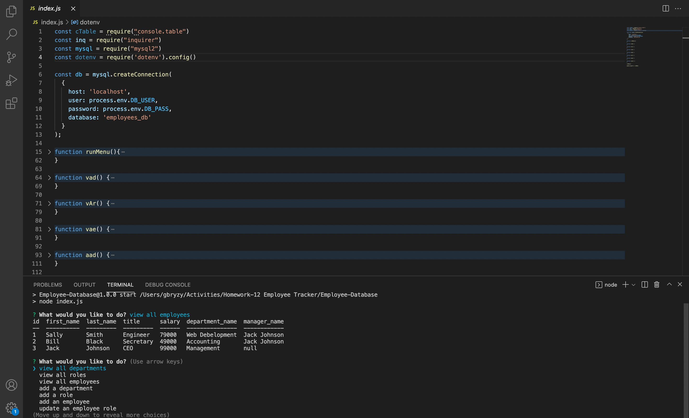

# Employee-Database

# Description
Employee Database provides a simple easy solution to anyone in need of a way to keep track of their employees' information, 
such as salary, department, and who they work under.

### Key Features
* Allows the ability to add new departments, roles, and employees. 
* All departments, roles, and employees can be viewed seperately by tables. 
* Allows the role of an employee to be updated after it has been created.
* Utelizes a command line interface that offers an easy way to navigate through the programs many options.

# Technologies
* Node.js

### Npm packages used:
* console.table
* inquirer
* dotenv
* mysql2

# Installation and Use
* Download source code.
* Run "npm install" in the terminal.
* Login to mysql and run "source db/schema.sql". If you want to use the seeds I provided for testing purposes, run "source db/seeds.sql".
* create a .env file and provide DB_USER and DB_PASS keys, OR change lines 9 and 10 in index.js to your user and password values.
* Lastly, run "npm start" in your terminal to start the program.

If you'd like to see a walk-through video on how to use this program, click here: 

Screenshot:  

